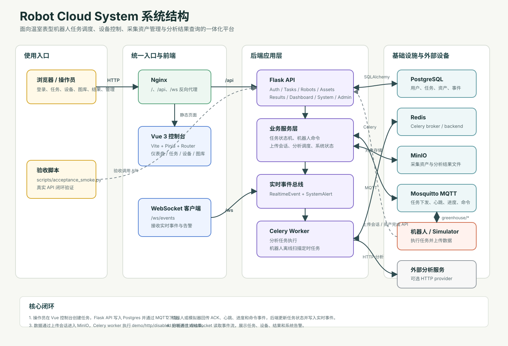

# Phenobot Cloud

**温室表型机器人云端一体化管控平台**

Phenobot Cloud 是一套面向温室表型采集场景的云端管控系统，提供任务全生命周期调度、机器人设备远程控制、采集资产管理与分析结果查询等能力。平台采用前后端分离架构，通过 MQTT 协议与机器人实时通信，支持多机器人并行作业与异步数据分析流水线。

---

## 目录

- [系统架构](#系统架构)
- [技术栈](#技术栈)
- [快速开始](#快速开始)
- [部署指南](#部署指南)
- [使用说明](#使用说明)
- [API 接口](#api-接口)
- [安全特性](#安全特性)
- [开发指南](#开发指南)
- [运维命令](#运维命令)
- [常见问题](#常见问题)
- [项目结构](#项目结构)
- [许可证](#许可证)

---

## 系统架构



```
┌─────────────┐     ┌─────────┐     ┌──────────────────────────────────────┐
│  Vue 前端    │────▶│  Nginx  │────▶│  Flask API (Gunicorn, 2 workers)    │
│  (静态资源)  │     │  :80    │     │  /api/*  /ws/events                 │
└─────────────┘     └─────────┘     └──────┬───────────────────────────────┘
                                           │
                    ┌──────────────────────┼──────────────────────┐
                    │                      │                      │
              ┌─────▼─────┐    ┌───────────▼──────────┐   ┌──────▼──────┐
              │ PostgreSQL │    │     Redis            │   │   MinIO     │
              │    :5432   │    │  Celery Broker       │   │   :9000     │
              └────────────┘    └───────────┬──────────┘   └─────────────┘
                                           │
                                    ┌──────▼──────┐
                                    │Celery Worker │
                                    │ + Beat       │
                                    └──────────────┘

┌─────────────┐     ┌─────────────┐     ┌─────────────┐
│  Simulator  │────▶│  Mosquitto  │◀────│  Backend    │
│  (演示机器人)│     │  MQTT :1883 │     │  Transport  │
└─────────────┘     └─────────────┘     └─────────────┘
```

### 模块职责

| 模块 | 职责 | 关键路径 |
|------|------|----------|
| **Vue 控制台** | 登录、总览、任务管理、设备监控、图库浏览、结果查询、系统管理 | `frontend/src/` |
| **Nginx** | 统一入口，反向代理 REST API 与 WebSocket，注入安全响应头 | `deploy/nginx.conf` |
| **Flask API** | 认证授权、任务管理、机器人控制、资产管理、结果查询、系统管理 | `backend/app/routes/` |
| **业务服务层** | 任务状态机驱动、MQTT 指令下发、上传会话管理、分析任务调度 | `backend/app/services/` |
| **Celery Worker** | 异步分析任务执行、机器人离线检测、过期事件清理 | `worker/` |
| **PostgreSQL** | 用户、角色、机器人、任务、资产、分析结果、实时事件等数据持久化 | `backend/app/models.py` |
| **MinIO** | 采集资产文件与分析结果文件的对象存储 | `backend/app/infra/storage.py` |
| **Mosquitto** | 云端与机器人之间的 MQTT 消息通信 | `backend/app/infra/transport/mqtt.py` |
| **Simulator** | 演示机器人，自动订阅任务与命令并上传模拟采集数据 | `simulator/robot_simulator.py` |

### 任务生命周期

任务状态转换由 `shared/state_machine.py` 严格约束，确保状态流转的合法性与一致性：

```
DRAFT → PENDING_DISPATCH → DISPATCHED → ROBOT_ACKED → RUNNING
  → DATA_UPLOADING → DATA_READY → ANALYZING → COMPLETED
                                            ↘ FAILED (可重试)
                              → CANCELLING → CANCELLED
```

---

## 技术栈

| 层级 | 技术 | 版本 |
|------|------|------|
| **前端** | Vue 3 + Vite 5 + Pinia + Vue Router 4 | Vue 3.4+, Vite 5.2+ |
| **后端** | Flask + SQLAlchemy 2 + Alembic | Flask 3.0+, SQLAlchemy 2.0+ |
| **异步任务** | Celery + Redis | Celery 5.4+, Redis 7 |
| **消息通信** | Eclipse Mosquitto (MQTT) | Mosquitto 2.x |
| **对象存储** | MinIO (S3 兼容) | Latest |
| **数据库** | PostgreSQL | 16 |
| **反向代理** | Nginx | 1.27 |
| **容器化** | Docker + Docker Compose | Compose v2.24+ |
| **CI/CD** | GitHub Actions | - |

---

## 快速开始

### 前置条件

- Docker Engine 20.10+
- Docker Compose v2.24+
- 以下端口可用：`80`、`5432`、`6379`、`1883`、`9000`、`9001`

### 启动平台

```bash
# 克隆项目
git clone <repository-url>
cd robot_cloud_system

# 一键启动
./scripts/docker_stack.sh up
```

启动完成后访问：

| 地址 | 说明 |
|------|------|
| `http://localhost` | 平台主入口 |
| `http://localhost/api/system/health` | 健康检查接口 |
| `http://localhost:9001` | MinIO 管理控制台 |

### 首次登录

冷启动时系统自动初始化演示管理员账户：

- **用户名**：`admin`
- **密码**：`demo-admin-pass-DO-NOT-USE-IN-PROD-2026`

> **注意**：此密码仅用于本地演示环境，切勿在生产环境使用。

暖启动时密码以上次设置为准。如需重置：

```bash
./scripts/docker_stack.sh demo-reset-admin
```

---

## 部署指南

### 环境变量加载优先级

Docker Compose 环境变量按以下顺序加载，后者覆盖前者：

1. `deploy/demo.env` — 默认演示配置
2. `STACK_ENV_FILE` — 可选覆盖文件（默认 `/dev/null`）
3. `environment` 块 — 服务级别的特定覆盖

### 生产部署

```bash
# 1. 从模板创建生产配置
cp .env.example .env.production

# 2. 编辑配置文件，替换所有 replace-with-* 占位符
# 使用以下命令生成安全密钥：
python3 -c "import secrets; print(secrets.token_urlsafe(48))"

# 3. 启动生产环境
STACK_ENV_FILE=../.env.production ./scripts/docker_stack.sh up
```

**必须覆盖的配置项**：

| 配置项 | 说明 |
|--------|------|
| `SECRET_KEY` | Flask 应用密钥 |
| `JWT_SECRET` | JWT 签名密钥 |
| `BOOTSTRAP_TOKEN` | 管理员初始化令牌 |
| `DATABASE_URL` | PostgreSQL 连接串 |
| `REDIS_URL` | Redis 连接串 |
| `MINIO_ROOT_USER` / `MINIO_ROOT_PASSWORD` | MinIO 凭证 |
| `MQTT_USERNAME` / `MQTT_PASSWORD` | MQTT 认证凭证 |

### 关键配置项说明

| 变量 | 默认值 | 说明 |
|------|--------|------|
| `APP_ENV` | `production` | 运行环境 |
| `ANALYSIS_PROVIDER` | `demo` | 分析提供者：`disabled` / `demo` / `http` |
| `TRANSPORT_BACKEND` | `mqtt` | 消息传输层：`memory` / `mqtt` |
| `STORAGE_BACKEND` | `minio` | 存储后端：`local` / `minio` |
| `TASK_QUEUE_BACKEND` | `celery` | 任务队列：`inline` / `celery` |
| `ROBOT_OFFLINE_TTL_SECONDS` | `30` | 机器人离线判定阈值（秒） |
| `MAX_UPLOAD_SIZE_BYTES` | `33554432` | 最大上传大小（32MB） |
| `RATE_LIMIT_LOGIN_MAX` | `10` | 登录尝试次数限制 |
| `RATE_LIMIT_LOGIN_WINDOW` | `300` | 限流窗口（秒） |
| `REALTIME_EVENT_TTL_HOURS` | `24` | 实时事件保留时长（小时） |
| `PASSWORD_MIN_LENGTH` | `12` | 密码最小长度 |

---

## 使用说明

### 任务管理流程

1. **创建任务**：在「任务管理」页面选择目标机器人，填写任务名称、类型与参数
2. **下发任务**：任务创建后进入待下发状态，点击「下发」将指令通过 MQTT 推送至机器人
3. **实时监控**：机器人执行过程中，通过 WebSocket 接收实时状态更新与进度推送
4. **数据上传**：机器人完成采集后通过上传会话将资产文件存入 MinIO
5. **分析处理**：数据就绪后自动触发分析任务，结果存入数据库
6. **结果查询**：在「结果查询」页面查看分析摘要与详细数据

### 机器人监控

- 在「设备监控」页面查看所有已注册机器人的在线状态与心跳信息
- 支持向机器人下发指令（如 `capture_image`、`cancel_task` 等）
- 命令执行状态实时追踪，支持历史记录回溯

### 数据资产

- 支持图片、深度图、点云、报告等多种资产类型
- 上传采用会话机制，支持分片上传与完整性校验（SHA-256）
- 文件下载使用一次性 Token，避免 JWT 暴露在 URL 中

---

## API 接口

### 统一响应格式

所有 API 接口返回统一的 JSON 结构：

```json
{
  "message": "ok",
  "data": {},
  "errors": {},
  "request_id": "uuid"
}
```

### 认证接口

| 接口 | 方法 | 说明 |
|------|------|------|
| `/api/auth/login` | POST | 用户登录，返回 access_token + refresh_token |
| `/api/auth/refresh` | POST | 刷新访问令牌 |
| `/api/auth/logout` | POST | 注销（撤销 refresh_token） |
| `/api/auth/bootstrap-admin` | POST | 初始化首个管理员账户 |
| `/api/auth/me` | GET | 获取当前用户信息 |

### 任务管理接口

| 接口 | 方法 | 说明 |
|------|------|------|
| `/api/tasks` | GET | 任务列表（支持分页、搜索、状态过滤） |
| `/api/tasks` | POST | 创建新任务 |
| `/api/tasks/:id` | GET | 任务详情（含时间线） |
| `/api/tasks/:id/dispatch` | POST | 下发任务至机器人 |
| `/api/tasks/:id/retry` | POST | 重试失败任务 |
| `/api/tasks/:id/cancel` | POST | 取消任务 |

### 机器人管理接口

| 接口 | 方法 | 说明 |
|------|------|------|
| `/api/robots` | GET | 机器人列表（含实时状态） |
| `/api/robots/register` | POST | 注册新机器人 |
| `/api/robots/:id/commands` | GET | 命令执行历史 |
| `/api/robots/:id/commands` | POST | 向机器人下发命令 |

### 数据资产接口

| 接口 | 方法 | 说明 |
|------|------|------|
| `/api/assets` | GET | 资产列表 |
| `/api/assets/:id` | GET | 资产详情 |
| `/api/assets/upload-sessions` | POST | 创建上传会话 |
| `/api/assets/upload-sessions/:id/content` | PUT | 上传文件内容 |
| `/api/assets/upload-sessions/:id/complete` | POST | 完成上传 |
| `/api/downloads/token` | POST | 获取一次性下载 Token |

### 分析结果接口

| 接口 | 方法 | 说明 |
|------|------|------|
| `/api/results` | GET | 结果列表 |
| `/api/results/:id` | GET | 结果详情 |

### 系统管理接口

| 接口 | 方法 | 说明 |
|------|------|------|
| `/api/dashboard/overview` | GET | 仪表盘概览数据 |
| `/api/system/health` | GET | 健康检查 |
| `/api/system/bootstrap-check` | GET | 就绪检查 |
| `/api/system/runtime` | GET | 运行时信息 |
| `/api/system/release-readiness` | GET | 发布门槛检查 |
| `/api/system/alerts` | GET | 系统告警列表 |
| `/api/users` | GET/POST | 用户管理（管理员） |
| `/api/roles` | GET | 角色列表（管理员） |

### WebSocket 实时事件

连接 `ws://localhost/ws/events`，首条消息进行认证：

```json
{"type": "auth", "token": "<access_token>", "last_event_id": "<optional>"}
```

认证成功后即可接收任务状态变更、机器人心跳等实时事件推送。

---

## 安全特性

本平台实施了多层安全防护机制：

| 特性 | 说明 |
|------|------|
| **JWT 双令牌** | Access Token（30 分钟）+ Refresh Token（7 天），支持自动刷新与令牌轮换 |
| **MQTT 认证** | 禁用匿名访问，强制用户名/密码认证 |
| **登录速率限制** | 基于 IP 的滑动窗口限流（5 分钟 / 10 次） |
| **一次性下载 Token** | 文件下载使用一次性 Token，JWT 不暴露在 URL 中 |
| **WebSocket 认证** | 首条消息认证模式，Token 不通过 URL 传递 |
| **SQL 注入防护** | LIKE 查询通配符转义，ORM 参数化查询 |
| **路径遍历防护** | 文件上传/下载路径严格校验 |
| **生产配置校验** | 强制检查密钥强度，禁止弱密码与默认凭据 |
| **CORS 白名单** | 仅允许配置的前端域名访问 |
| **命令白名单** | 机器人命令类型限制 |
| **密码策略** | 最少 12 位，Werkzeug 哈希存储 |
| **Nginx 安全头** | X-Frame-Options、CSP、HSTS、速率限制 |

---

## 开发指南

### 本地后端开发

```bash
# 安装依赖
pip install -r backend/requirements.txt

# 启动开发服务器（需要 PostgreSQL, Redis, MinIO, Mosquitto 服务）
python -m flask --app backend.run run

# 运行测试
python -m pytest tests/ -v
```

### 本地前端开发

```bash
cd frontend

# 安装依赖
npm install

# 启动开发服务器（http://localhost:5173）
npm run dev

# 运行单元测试
npm test

# 代码检查
npm run lint

# 生产构建
npm run build
```

### 代码规范

- **后端**：Ruff 静态分析（E、F、W 规则）
- **前端**：ESLint + eslint-plugin-vue
- **测试**：pytest（后端）、Vitest（前端）
- **CI**：GitHub Actions 自动运行 lint、测试与构建

---

## 运维命令

所有运维操作通过 `./scripts/docker_stack.sh` 统一管理：

### 生命周期管理

```bash
./scripts/docker_stack.sh up              # 构建并启动所有服务
./scripts/docker_stack.sh down            # 停止所有服务
./scripts/docker_stack.sh reset           # 停止并删除数据卷
./scripts/docker_stack.sh restart         # 重启所有服务
./scripts/docker_stack.sh ps              # 查看容器状态
./scripts/docker_stack.sh logs [svc...]   # 查看服务日志
```

### 构建与缓存

```bash
./scripts/docker_stack.sh rebuild         # 无缓存重建所有镜像
./scripts/docker_stack.sh pull-base-images # 预拉取基础镜像
./scripts/docker_stack.sh clean            # 清理构建缓存
```

### 验证与测试

```bash
./scripts/docker_stack.sh smoke           # 暖启动验收测试
./scripts/docker_stack.sh cold-smoke      # 冷启动验收测试
./scripts/docker_stack.sh test            # 运行全部测试
./scripts/docker_stack.sh test-backend    # 仅运行后端测试
./scripts/docker_stack.sh test-frontend   # 仅运行前端测试
```

### 管理操作

```bash
./scripts/docker_stack.sh demo-reset-admin  # 重置演示管理员密码
```

---

## 常见问题

### 登录失败

```bash
# 重置管理员密码
./scripts/docker_stack.sh demo-reset-admin

# 彻底重置（清除所有数据）
./scripts/docker_stack.sh reset && ./scripts/docker_stack.sh up
```

### MQTT 连接失败

确认 `mosquitto` 容器状态为 `healthy`，检查 `MQTT_USERNAME` 和 `MQTT_PASSWORD` 配置是否正确。

### 服务连接拒绝

检查对应容器是否处于健康状态，确认环境变量使用 Docker 服务名（如 `minio:9000`）而非 `localhost`。

### Docker Hub 拉取不稳定

```bash
# 预拉取基础镜像后再启动
./scripts/docker_stack.sh pull-base-images
./scripts/docker_stack.sh up
```

---

## 项目结构

```
├── backend/                  # Flask 后端应用
│   └── app/
│       ├── routes/           # API 路由（9 个 Blueprint）
│       ├── services/         # 业务服务层（13 个服务）
│       ├── infra/            # 基础设施适配（数据库、存储、队列、传输）
│       ├── models.py         # SQLAlchemy 数据模型（15 张表）
│       └── config.py         # 配置管理与运行时校验
├── frontend/                 # Vue 3 前端应用
│   └── src/
│       ├── api/              # API 服务层
│       ├── components/       # 通用组件
│       ├── views/            # 页面视图（10 个视图）
│       ├── stores/           # Pinia 状态管理
│       ├── composables/      # 组合式函数
│       └── styles/           # 样式系统（Design Tokens）
├── shared/                   # 前后端共享模块（枚举、状态机、MQTT Topic）
├── worker/                   # Celery 后台任务
├── simulator/                # 机器人模拟器
├── deploy/                   # Docker 部署配置
├── alembic/                  # 数据库迁移脚本
├── tests/                    # 后端测试套件
├── scripts/                  # 运维脚本
├── docs/                     # 项目文档
├── Makefile                  # 快捷命令
└── .github/workflows/        # CI/CD 流水线
```

---

## 许可证

内部项目，未公开发布。
